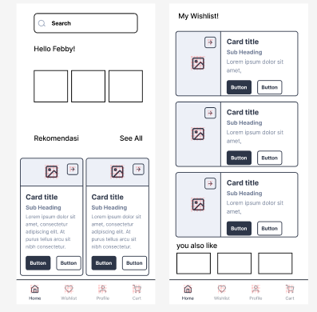
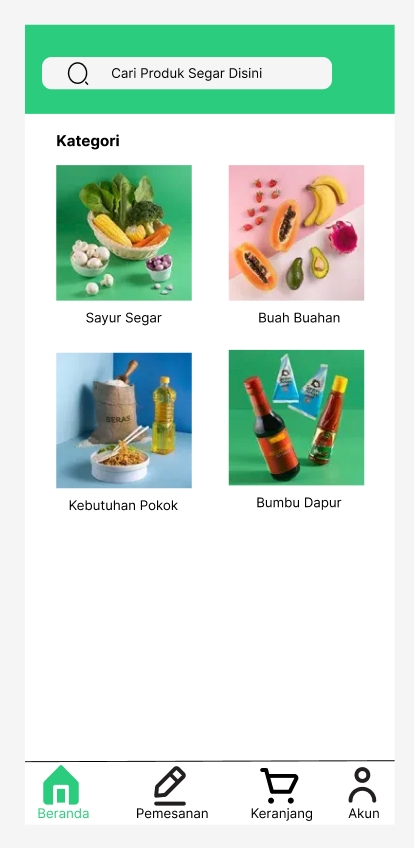

# Design

Aplikasi GoPlant dibangun menggunakan front-end client, backend server, dan database. Client front-end akan diimplementasikan menggunakan HTML, CSS, dan JavaScript, dan akan berkomunikasi dengan server backend menggunakan RESTful API. Server backend akan menggunakan database MySQL untuk menyimpan data pemesanan pelanggan dan juga alamat pengiriman.

# User interface design:

- Daftar produk: Halaman yang menampilkan daftar produk yang tersedia dari petani lokal, termasuk foto, deskripsi, harga, dan jumlah stok.

- Pencarian dan filter: Fitur pencarian yang memungkinkan pengguna untuk menemukan produk yang sesuai dengan kriteria tertentu, seperti jenis produk, lokasi petani, atau harga.

- Keranjang belanja: Pengguna dapat menambahkan produk ke keranjang belanja mereka dan meninjau daftar produk yang telah dipilih.

- Checkout: Proses checkout yang mudah dan aman yang memungkinkan pengguna untuk melakukan pembayaran dan mengirimkan alamat pengiriman.

## Wireframe

Screenshots of wireframes

some caption.

## Mockups

Screenshots of mockups

some caption.

# Demo
[GoPlant](https://www.figma.com/file/EKEZN0TyNt2WOTH3weAKKU/Untitled?node-id=0%3A1&t=r7QUh8WeMeIiJj4O-1)