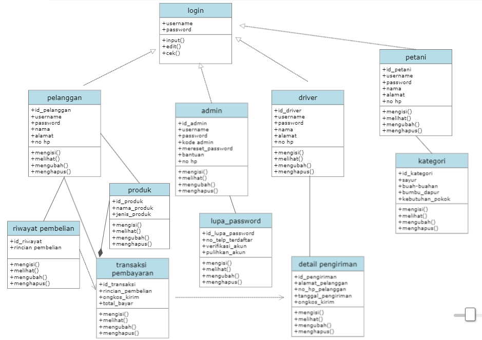
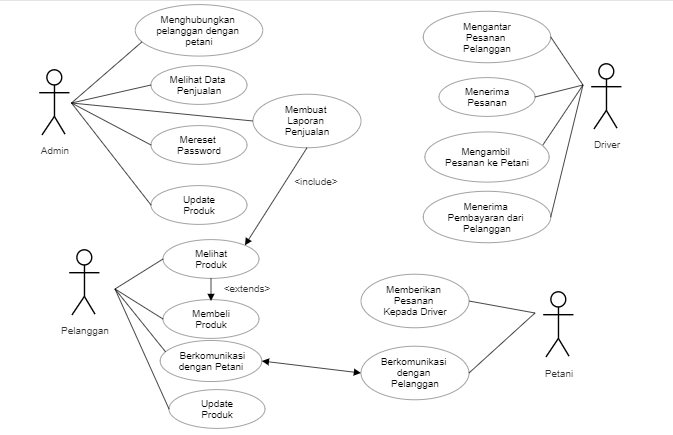
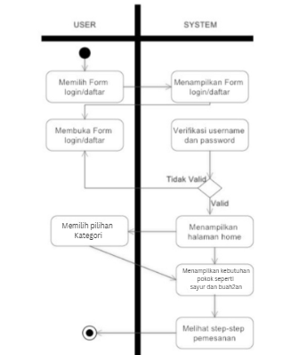

# Requirements

- User Interface harus mengizinkan pengguna untuk membuat pesanan baru dengan menginput pesanan nya serta alamat pengantaran.
- User Interface harus mengizinkan pengguna untuk mengedit pemesanan pelanggan.
- User Interface harus mengizinkan pengguna untuk menghapus pesanan pelanggan.
- Setiap riwayat pemesanan dapat ditampilkan di aplikasi GoPlant.
- Aplikasi harus memiliki sistem notifikasi yang mengirimkan pengingat kepada pengguna melalui email atau push notification ketika pesanan mereka segera sampai.
- Aplikasi harus memiliki sistem masuk yang aman untuk melindungi data pengguna, menggunakan teknik enkripsi standar industri.

# UML

- Class Diagram

- Use Case Diagram

- Activity Diagram

