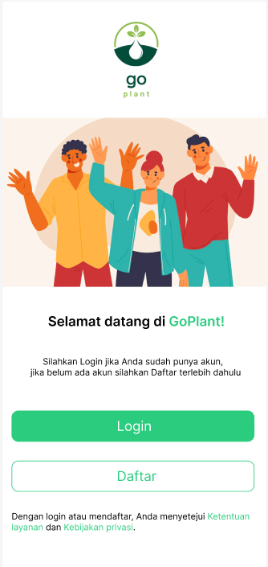

# Introduction

Memperkenalkan hasil bumi kami yang segar dan bersumber secara lokal. Petani kami sangat berhati-hati dalam menanam dan memanen setiap tanaman, memastikan Anda mendapatkan kualitas dan rasa terbaik. Dengan memilih opsi farm-to-table kami, Anda tidak hanya mendukung petani lokal dan komunitas mereka, tetapi juga membuat pilihan sadar untuk sistem pangan yang lebih sehat dan berkelanjutan. Bergabunglah dengan kami dalam merayakan rasa dan manfaat nutrisi dari buah dan sayuran yang ditanam secara lokal.

# Background

Penggunaan teknologi dalam pertanian, khususnya aplikasi mobile, telah meningkat dalam beberapa tahun terakhir. Salah satu aplikasi yang dibuat adalah GoPlant, yang bertujuan untuk menghubungkan petani lokal dengan konsumen di lingkungan mereka. Aplikasi ini memungkinkan petani untuk mencantumkan produk pertanian mereka yang tersedia, dan konsumen dapat membeli langsung dari petani, tanpa perantara. Ini tidak hanya mendukung komunitas petani lokal, tetapi juga mempromosikan konsumsi buah dan sayuran segar yang dihasilkan lokal. GoPlant juga memungkinkan petani untuk mengelola persediaan, melacak penjualan, dan berkomunikasi dengan pelanggan. Dengan GoPlant, konsumen dapat dengan mudah mendapatkan makanan yang segar dan sehat, serta mendukung petani lokal. Dengan menggunakan aplikasi ini, kami berharap dapat membangun sistem pangan yang berkelanjutan dan tangguh, di mana petani dan konsumen dapat memiliki hubungan yang langsung dan transparan.
